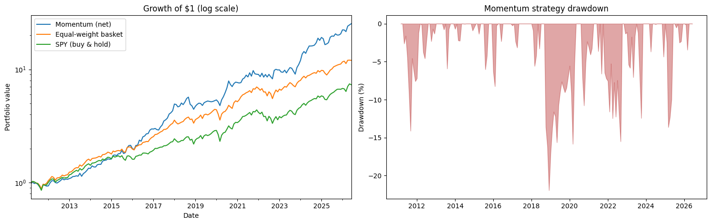
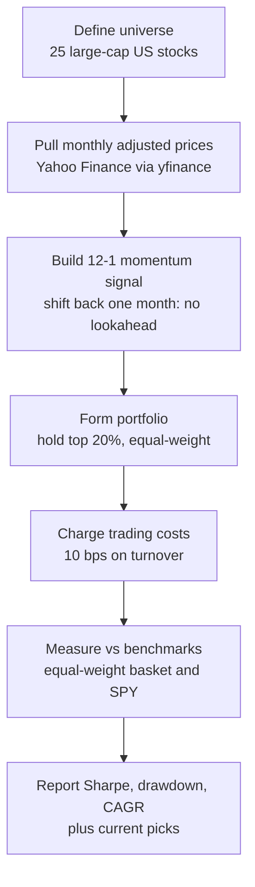

# Momentum Strategy Backtest

A cross-sectional momentum strategy on large-cap US stocks, backtested with the parts most backtests quietly skip: realistic trading costs, strict no-lookahead, and fair benchmarks. Each month it ranks 25 stocks by recent trend, buys the top fifth, holds for a month, and repeats.

[](https://colab.research.google.com/github/e-akselrod/momentum-backtest/blob/main/Momentum_Backtest.ipynb)


The strategy itself is deliberately simple. The work is in testing it honestly, because that is where most backtests fall apart.

## Contents
- [Why this exists](#why-this-exists)
- [Quick start](#quick-start)
- [Results](#results)
- [How it stays honest](#how-it-stays-honest)
- [How it works](#how-it-works)
- [What it would buy now](#what-it-would-buy-now)
- [What this is not](#what-this-is-not)
- [Roadmap](#roadmap)
- [Installation](#installation)
- [Contributing and license](#contributing-and-license)

## Why this exists

Momentum is one of the most documented anomalies in finance, and also one of the easiest to fake a great result with. Drop a single look-ahead bug, ignore turnover, or compare against the wrong benchmark, and a mediocre strategy looks like alpha. This project takes the textbook 12-minus-1 momentum rule and runs it under conditions that would survive a quant interview. Every number is measured the way a skeptical reviewer would want it measured.

## Quick start

```bash
git clone https://github.com/e-akselrod/momentum-backtest.git
cd momentum-backtest
pip install -r requirements.txt
jupyter notebook Momentum_Backtest.ipynb   # run top to bottom
```

No account or API key needed. Prices come from Yahoo Finance through yfinance. You can also open it directly in Colab with the badge above.

## Results



Backtest window 2011-03 to 2026-06 (184 months):

| Strategy | CAGR | Volatility | Sharpe | Max drawdown |
|---|---|---|---|---|
| Momentum (net) | 23.4% | 18.2% | 1.25 | -21.9% |
| Momentum (gross) | 24.1% | 18.2% | 1.28 | -21.8% |
| Equal-weight basket | 17.6% | 13.9% | 1.25 | -21.1% |
| SPY (buy and hold) | 13.9% | 14.5% | 0.97 | -24.0% |

The honest read: against SPY, the strategy wins clearly on both return and risk-adjusted return (Sharpe 1.25 vs 0.97). Against an equal-weight basket of the same 25 names, the risk-adjusted edge is essentially zero. Net of costs the two carry the same Sharpe (1.25), and momentum's higher CAGR comes entirely from running more volatility (18.2% vs 13.9%), not from a better return per unit of risk. The gap between the gross and net rows (1.28 vs 1.25 Sharpe) is what the trading costs, and at roughly 510% average annual turnover the strategy trades a lot.

That last point is the finding, not a disappointment. A simple momentum rule beats the index but does not beat a naive equal-weight version of the same universe once costs are paid. A backtest that surfaces that is more useful than one that hides it.

## How it stays honest

Three choices do the heavy lifting:

- **No lookahead.** The signal on any date uses prices shifted back one month, and portfolio weights are shifted forward one month before returns are applied. Decisions are made first, returns collected after, so the backtest can never trade on information it would not have had at the time.
- **Real trading costs.** 10 bps is charged on turnover every time the target weights change. Momentum turns over heavily, so this is not a rounding error, and the gross-versus-net gap shows its full price.
- **Fair benchmarks.** Performance is judged against an equal-weight basket of the same stocks and against SPY, not against zero. Beating cash is easy. Beating a sensible alternative is the real test.

## How it works



In short: pick the universe, pull monthly prices, rank by 12-minus-1 momentum (the 12-month return ending one month ago, skipping the most recent month because of short-term reversal), hold the top fifth equal-weighted, charge costs on turnover, and compare against the two benchmarks on Sharpe, drawdown, and CAGR.

## What it would buy now

The strategy's equal-weighted picks for the most recent month in the data (2026-06). A quick gut check that the holdings look reasonable:

| Ticker | 12-month momentum |
|---|---|
| CAT | 1.54 |
| GOOGL | 1.22 |
| GS | 0.74 |
| MRK | 0.60 |
| NVDA | 0.56 |

These shift as new price data comes in.

## What this is not

A research backtest, not a trading system, and it is upfront about its limits:

- **Survivorship bias.** The universe is today's large-caps. Names that blew up or were delisted are not in it, which flatters every row in the results table, benchmarks included. The real fix is a point-in-time universe (index membership as it actually stood each month).
- **Costs are a flat estimate.** Real costs include the bid-ask spread, market impact, and slippage, so live costs would run higher than 10 bps.
- **Nothing is tuned out of sample.** The 12-month lookback, monthly rebalance, and top-fifth cutoff are standard but were not validated on separate data.
- **Monthly bars only.** Anything that happens within a month is invisible to the backtest.

## Roadmap

Natural next steps: add a short side (sell the bottom fifth) to make it roughly market-neutral and check whether Sharpe improves, rerun on a point-in-time universe to remove the survivorship bias, or scale exposure down when volatility spikes and measure the effect on drawdown.

## Installation

Requires Python 3.9 or newer. Dependencies (yfinance, pandas, numpy, matplotlib) install with:

```bash
pip install -r requirements.txt
```

## Contributing and license

This is a personal portfolio project. Issues and suggestions are welcome through the GitHub issue tracker. Released under the MIT License (see LICENSE).
